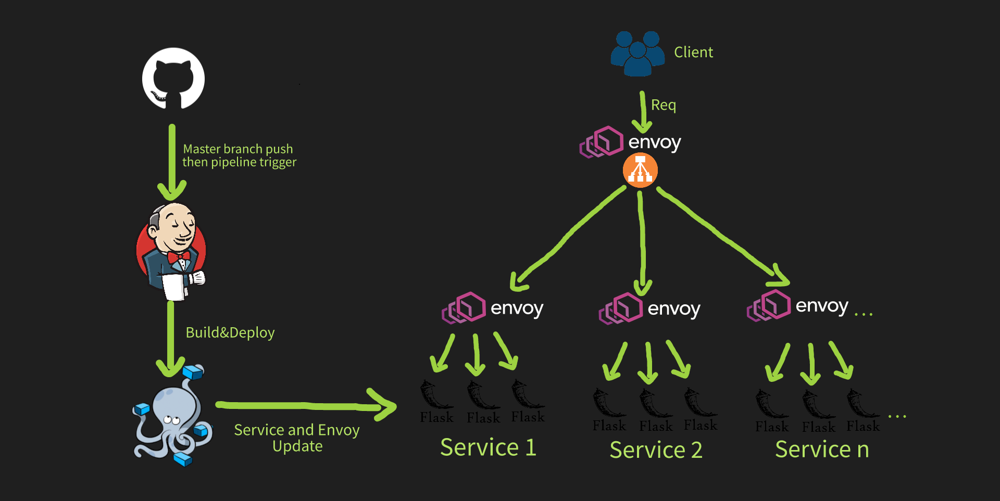
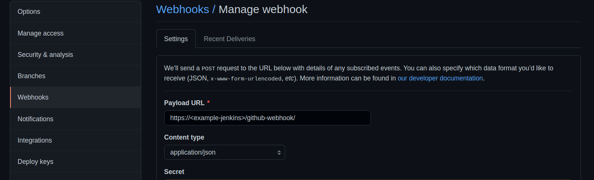
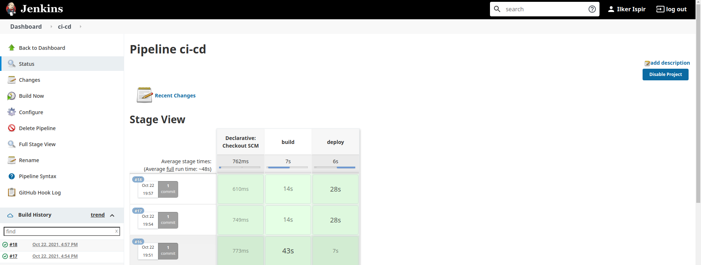
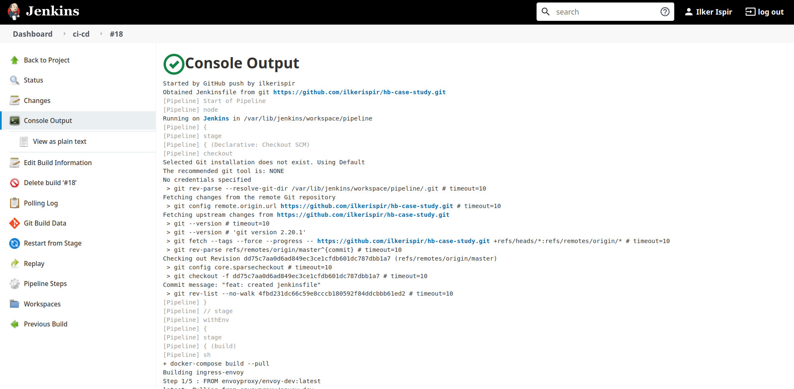

# HB Case Study


## [Envoy Proxy](https://www.envoyproxy.io/)
- It is a modern Layer7(App) and Layer3(TCP) proxy
- Incredibly modernized version of reverse proxies like NGINX, HAProxy
- It is used in many projects: Istio service mash, API gateway products, etc.
- Interesting part: Programming via API instead of file (xDS protocol)
- Developed by Matt Klein at Lyft
- Donated to CNCF(Kubernetes, gRPC, etc.) It graduated from there.
- Those who integrate Envoy into their infrastructure: Google, AWS, etc.
- It has support for Wire protocols(Redis, Memcached, MySQL, MongoDB, etc.)
- RPC level LB instead of connection-level LB

### Telemetry/Observability Properties
- Metrics(L7 HTTP metrics)
    * Request count
    * Latency
    * Error rate
    * Status code
    * Bytes received/sent
    * Envoy's own metrics(CPU/Memory, TCP connection, Bytes, Bandwidth, QPS)
- Distributed Tracing
    * A monitoring method that shows how long the RPCs between microservices keep and where they go.
    * Add TRACING HEADER if missing in incoming requests
    * Upload TRACEs to a certain location for requests coming to the server
        * Request In TRACE ID, start, end(Response)

#

## [Architecture](https://www.envoyproxy.io/)


#

## API Reference
#### Get service

```http
  GET /service/${id}
```

| Parameter | Type     | Description                       |
| :-------- | :------- | :-------------------------------- |
| `id`      | `string` | **Required**. Id of item to fetch |

#### Example Response

```
{
  "hostname": "fc4a73df5ae8",
  "ip": "172.20.0.5",
  "serviceid": "1",
  "success": true,
  "time": "2021-10-22 18:05:12"
}
```
#


### [CI/CD - Jenkins](https://www.envoyproxy.io/)

The leading open source automation server, Jenkins provides hundreds of plugins to support building, deploying and automating any project.

### GitHub Webhook


Jenkins trigger pipeline(Jenkinsfile):
```
pipeline {
    agent any
    stages {
        stage('build') {
            steps {
                sh "docker-compose build --pull"
            }
        }
        stage('deploy') {
            steps {
                sh "docker-compose up -d"
                sh "docker-compose scale service1=3 service2=3"
            }
        }
    }
}
```
### Pipeline Dashboard


### Console Output 


#

## Start all of our containers
```
docker-compose build --pull
docker-compose up -d
docker-compose scale service1=3 service2=3
```

## Remove all containers & images
```
docker rm -vf $(docker ps -a -q)
docker rmi -f $(docker images -a -q)
```

#

## References
* Envoy: https://www.envoyproxy.io/
* Envoy GitHub: https://github.com/envoyproxy/envoy
* Envoy control plane: https://static.sched.com/hosted_files/kccncna20/03/BuildingAnEnvoyControlPlane.pdf
* Drawing for flowchart: https://sketch.io/sketchpad/
* Jenkins installation: https://www.jenkins.io/doc/book/installing/linux/
* Ahmetb broadcast: https://www.youtube.com/watch?v=Uiv5m20lYaE

#

## 🔗 Links
[](https://ilkerispir.com/)
[](https://www.linkedin.com/in/ilkerispir/)

#

## Author
- [@ilkerispir](https://www.github.com/ilkerispir)